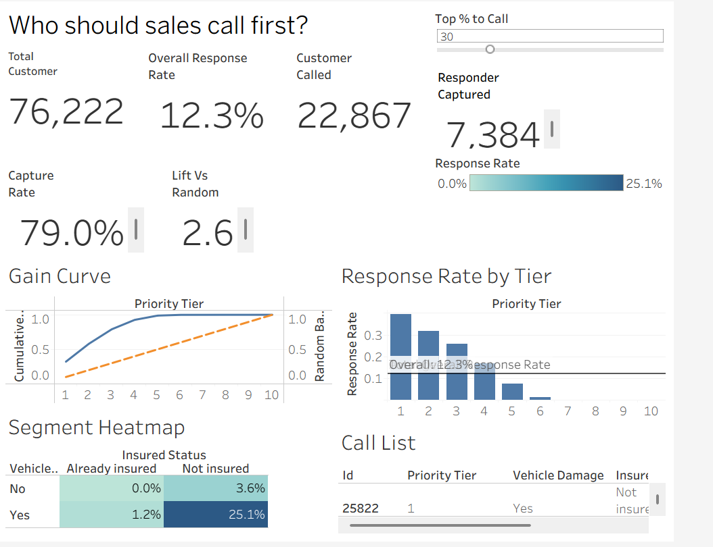

# Dealership Cross-Sell Propensity Model

## Business question
Sales can't call every customer. Who should they call first,
and how much does that improve results?

**Answer:** calling the top 30% of customers ranked by the model reaches **79.0% of all likely responders**, a **2.6× lift** over calling at random.

## Results
Scored on a held-out test set of 76,222 customers (20% stratified split, never seen in training).

| Metric | Result |
|---|---|
| LightGBM ROC-AUC | **0.857** (logistic regression baseline: 0.850) |
| Overall response rate | 12.3% |
| Top-decile lift | **3.2×**: the top 10% of customers capture 32.2% of responders |
| Capture at 30% of customers called | **79.0%** of responders, **2.6× lift** |
| Strongest driver (SHAP and SQL EDA agree) | Vehicle damage + not previously insured: **25.1%** response rate vs 12.3% overall |

SHAP's top three drivers are `previously_insured`, `vehicle_damage` and `age`. Vehicle age looks strong in the raw SQL numbers but adds little in the model, because it overlaps with insurance status, damage and age. That check is documented in `notebooks/01_model.ipynb`, section 8.1.

## Dashboard
Tableau Public: (https://public.tableau.com/views/DealershipCross-SellPropensityDashboard/Dashboard1?:language=en-US&:sid=&:redirect=auth&:display_count=n&:origin=viz_share_link)

The "Top % to Call" slider drives the targeting simulator: it shows how many customers are called, how many responders that captures, and the lift over random targeting.

## Dataset
Kaggle: Health Insurance Cross Sell Prediction
Download the CSV and place it in `data/raw/`
(the `data/` folder is not pushed to GitHub).

This is a public dataset reframed as a dealership cross-sell case. It is not real client or employer data.

## Tools
SQL (Postgres), Python (scikit-learn, LightGBM, SHAP), Tableau

## Project structure
- `sql/01_eda.sql`: exploratory queries, with their results as comments
- `notebooks/01_model.ipynb`: preprocessing, baseline, LightGBM, lift table, SHAP, export
- `notebooks/shap_summary.png`: SHAP summary plot
- `dashboard/customer_scores.csv`: scored test set (the input to Tableau)
- `dashboard/screenshot.png`: dashboard screenshot

## Project status
- [x] SQL EDA
- [x] Model
- [x] Tableau dashboard
- [x] Results and business impact
