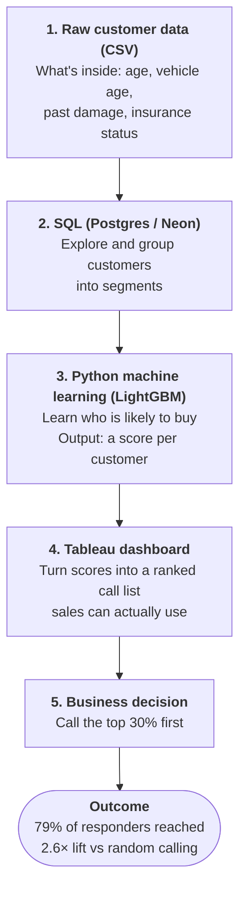

# Dealership Cross-Sell Propensity Model

## How it works
A dealership has more customers than its sales team can call. This project answers: who should they call first, and how much does that improve results over calling people at random?

The model's top 30% of ranked customers captured 79% of all responders — a 2.6x lift over random targeting (AUC 0.857).

### Skills demonstrated
| Stage | What it shows | Skill set |
|---|---|---|
| SQL (Postgres / Neon) | Loading data, segment analysis, response rates by customer group | Data analyst |
| Python (scikit-learn, LightGBM, SHAP) | Baseline vs. gradient-boosted model, class-imbalance handling, lift/decile evaluation, explaining the model's drivers | Data scientist |
| Tableau | Ranked call list, targeting simulator, segment heatmap for a non-technical audience | Data analyst / BI |

## Results
Scored on a held-out test set of 76,222 customers (20% stratified split, never seen in training).

| Metric | Result |
|---|---|
| LightGBM ROC-AUC | **0.857** (logistic regression baseline: 0.850) |
| Overall response rate | 12.3% |
| Top-decile lift | **3.2×**: the top 10% of customers capture 32.2% of responders |
| Capture at 30% of customers called | **79.0%** of responders, **2.6× lift** |
| Strongest driver (SHAP and SQL EDA agree) | Vehicle damage + not previously insured: **25.1%** response rate vs 12.3% overall |

SHAP's top three drivers are `previously_insured`, `vehicle_damage` and `age`. Vehicle age looks strong in the raw SQL numbers but adds little in the model, because it overlaps with insurance status, damage and age. That check is documented in `notebooks/01_model.ipynb`, section 8.1.

## Dashboard
Tableau Public: [Dealership Cross-Sell Propensity Dashboard](https://public.tableau.com/app/profile/valentinus.gunawan/viz/DealershipCross-SellPropensityDashboard/Dashboard1)

The "Top % to Call" slider drives the targeting simulator: it shows how many customers are called, how many responders that captures, and the lift over random targeting.

## Dataset
Kaggle: [Health Insurance Cross Sell Prediction](https://www.kaggle.com/datasets/anmolkumar/health-insurance-cross-sell-prediction?select=train.csv)
Download `train.csv` and place it in `data/raw/`
(the `data/` folder is not pushed to GitHub).

This is a public dataset reframed as a dealership cross-sell case. It is not real client or employer data.

## Tools
SQL (Postgres), Python (scikit-learn, LightGBM, SHAP), Tableau

## Project structure
- `sql/01_eda.sql`: exploratory queries, with their results as comments
- `notebooks/01_model.ipynb`: preprocessing, baseline, LightGBM, lift table, SHAP, export
- `notebooks/shap_summary.png`: SHAP summary plot
- `dashboard/customer_scores.csv`: scored test set (the input to Tableau)
- `dashboard/screenshot.png`: dashboard screenshot

## Project status
- [x] SQL EDA
- [x] Model
- [x] Tableau dashboard
- [x] Results and business impact
